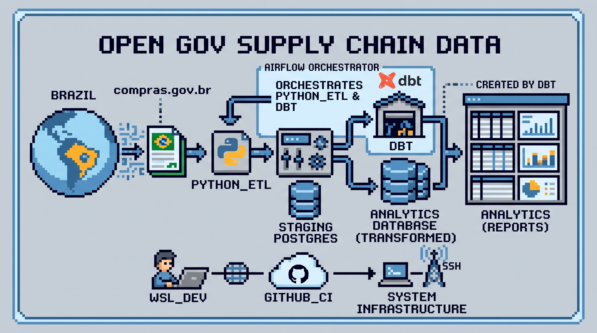
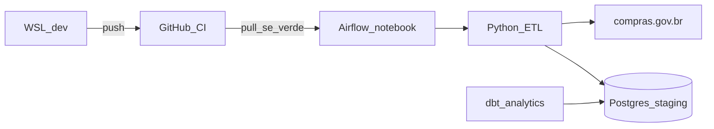

# Open Gov Supply Chain Data

## 1. Sobre o que é o projeto

Plataforma de dados abertos de **compras públicas** do
[compras.gov.br](https://dadosabertos.compras.gov.br) para **consultoria**:
catálogos (CATMAT/CATSER), preços praticados, planejamento (PGC), UASGs,
licitações (Lei 8.666 e Lei 14.133), ARP, contratos, fornecedores e OCDS.

O dado bruto entra no Postgres (`staging`). Em cima disso saem análises
reutilizáveis — preço, órgão, item, fornecedor — sem depender de planilha
avulsa.

## 2. Por que o projeto existe

O volume e a variedade desses dumps não cabem em extração pontual. É um
projeto grande de **dados e análises**: ingestão contínua, histórico
retomável, qualidade de chave e um modelo analítico estável para
responder perguntas de consultoria (o que se compra, por quanto, de quem,
em qual regra).

Desenvolver no WSL e operar no homelab evita misturar experimento com a
carga que alimenta a análise.

## 3. Como foi criado

Três peças, cada uma com um papel:

| Peça | Função |
| --- | --- |
| **Python** (`src/etl`) | Ingestão: API → valida JSON → upsert em `staging` |
| **Airflow 3** (`dags/`) | Orquestra cada script como DAG manual (uma por endpoint) |
| **dbt** (`dbt-open-gov/`) | Views/tabelas em `analytics` (dims, facts, bridges) |

A produção roda num **notebook** (homelab, `ssh homelab`):

- clone em `~/projetos/open-gov-supply-chain-data`
- Airflow em `~/data-eng/airflow` (LocalExecutor, UI na porta **8080**)
- Postgres de dados na **5432** (`postgres_db`); metadata do Airflow é outro
  container
- Filebrowser na **8084** (o 8080 ficou para o Airflow)
- runner `open-gov-homelab` (`systemctl --user`) puxa `main` depois do CI

Dev é este WSL. `git push` em `main` roda pytest no GitHub; se passar, o
notebook faz `git pull`. DAGs continuam pausadas até alguém disparar.

Detalhe operacional: [`docs/guia-deploy.md`](docs/guia-deploy.md).

## 4. Arquitetura

| Camada | Onde | O que faz |
| --- | --- | --- |
| Ingestão | `src/etl/ingestion/` | Páginas da API, watermark, upsert |
| Orquestração | `dags/open_gov_*.py` | Dispara `main()` de cada script |
| Destino bruto | schema `staging` | DDL em `src/sql/` |
| Análise | `dbt-open-gov/models/` | `staging` views → `analytics` |
| Dev | WSL | Código e testes |
| Prod | notebook | Airflow + Postgres + dbt + CI pull |

Domínios em `staging`: CATMAT, CATSER, preços, PGC, UASG, legado,
contratações, ARP, contratos, fornecedor, OCDS, indicadores, Alice.

Documentação: [`docs/README.md`](docs/README.md).
