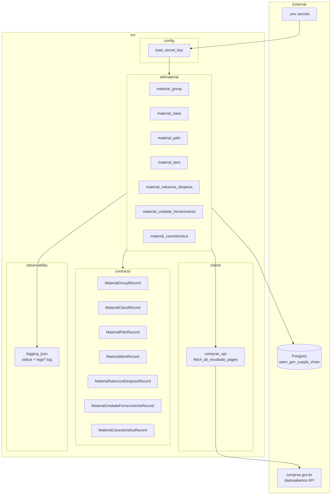
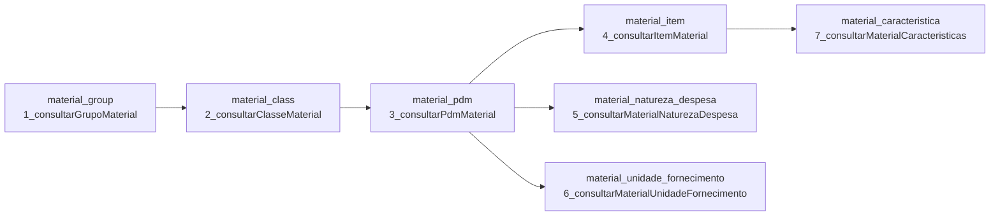
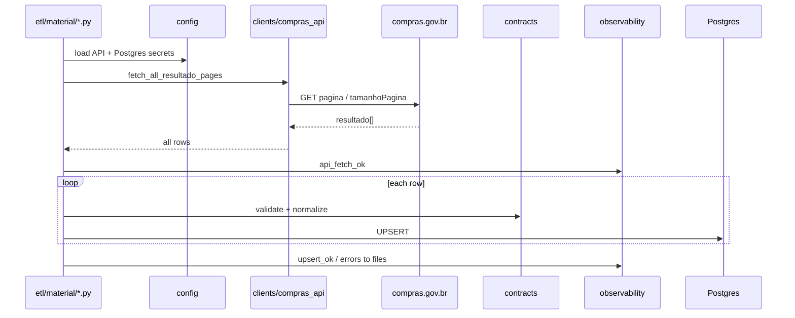

# Architecture — Open Gov Supply Chain Data (CATMAT)

Snapshot of the material ETL architecture as of 2026-09-18.

## System layers

## Load order and table FKs (CATMAT hierarchy)

**Recommended run order:** group → class → pdm → (item | natureza | unidade) → caracteristica (after item).

## Single ETL pipeline (shared pattern)

## Module map

| Layer | Path | Role |
| --- | --- | --- |
| Config | `src/config/load_secret_key.py` | Load secrets from `.env` |
| Client | `src/clients/compras_api.py` | Paginated API fetch |
| Contracts | `src/contracts/material_*.py` | Pydantic validation / normalization |
| ETL | `src/etl/material/*.py` | Extract → validate → upsert |
| SQL | `src/sql/create_table_*.sql` | Table DDL |
| Observability | `src/observability/logging_json.py` | JSON logs to stdout + per-level files |
