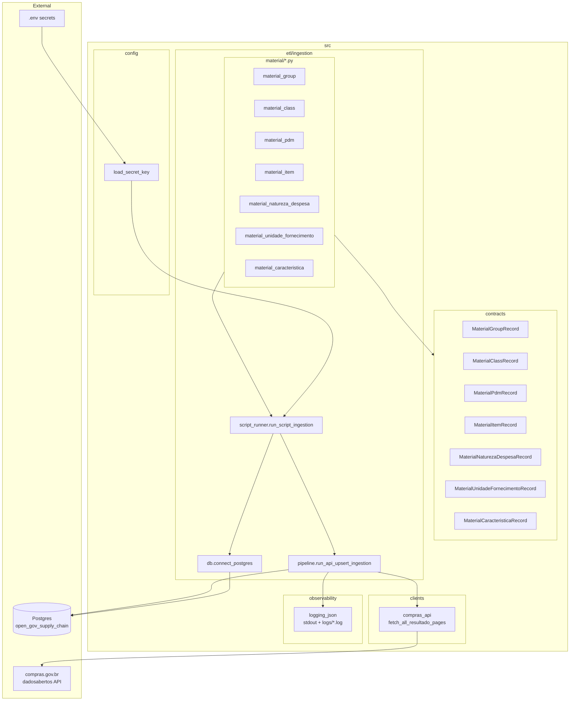
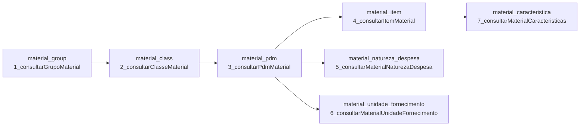
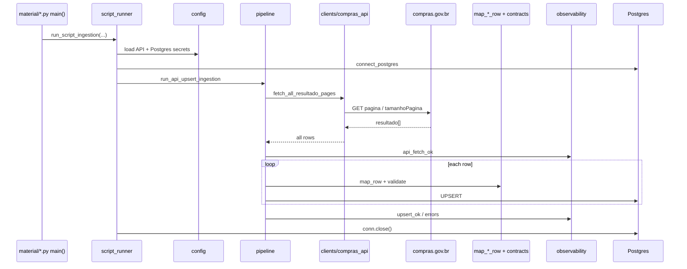

# Architecture — Open Gov Supply Chain Data (CATMAT)

Snapshot of the material ETL architecture as of 2026-09-18
(updated after the shared API→upsert ingestion refactor).

## System layers



## Load order and table FKs (CATMAT hierarchy)



**Recommended run order:** group → class → pdm → (item | natureza | unidade) → caracteristica (after item).

## Shared ingestion pipeline

Reusable for any paginated `resultado` API → Postgres upsert ETL
(not only material). See also [ingestion-api-upsert-refactor.md](./ingestion-api-upsert-refactor.md).



## Module map

| Layer | Path | Role |
| --- | --- | --- |
| Config | `src/config/load_secret_key.py` | Load secrets from `.env` |
| Client | `src/clients/compras_api.py` | Paginated API fetch |
| Contracts | `src/contracts/material_*.py` | Pydantic validation / normalization |
| DB wrapper | `src/etl/ingestion/db.py` | Injectable Postgres connect |
| Pipeline | `src/etl/ingestion/pipeline.py` | Fetch → map → upsert |
| Script runner | `src/etl/ingestion/script_runner.py` | Wire secrets + DB for CLI/Airflow scripts |
| ETL scripts | `src/etl/ingestion/material/*.py` | Endpoint, SQL, `map_row`, `main()` |
| SQL | `src/sql/create_table_*.sql` | Table DDL |
| Observability | `src/observability/logging_json.py` | JSON logs to stdout + per-level files |

## Run a material script

```bash
PYTHONPATH=src python src/etl/ingestion/material/material_item.py
```
