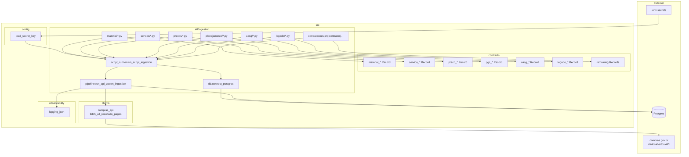
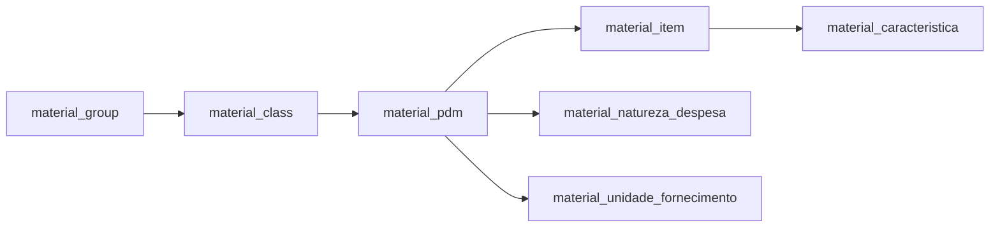
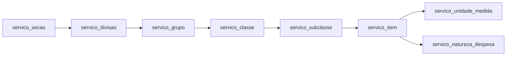
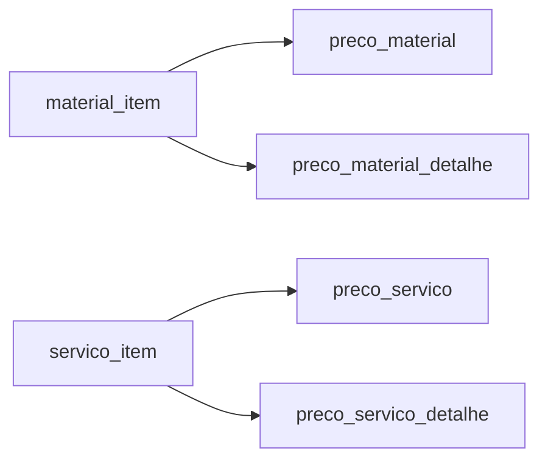
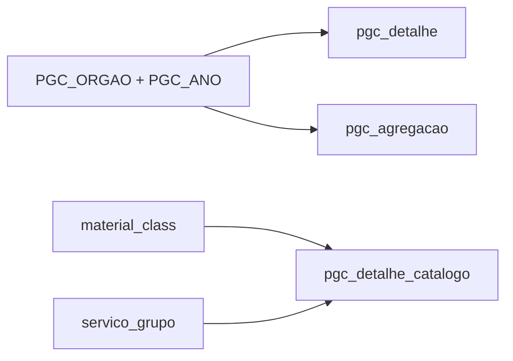
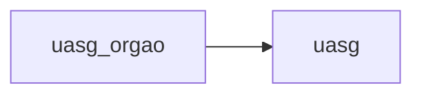
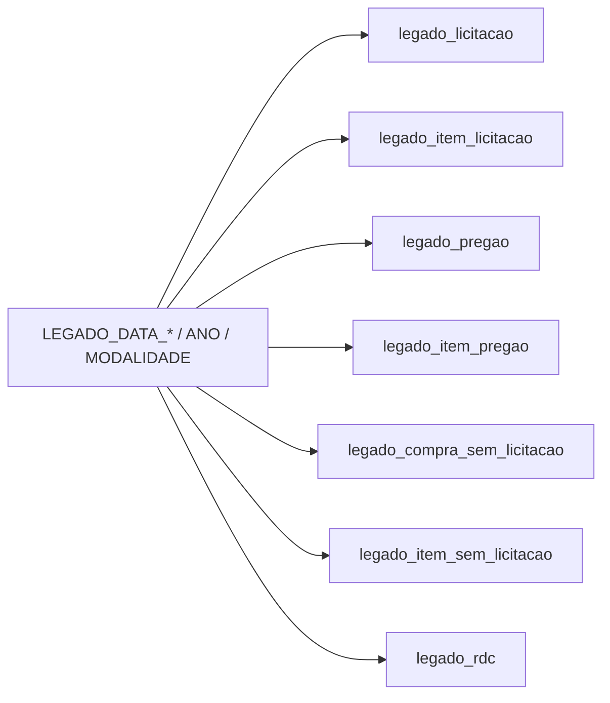
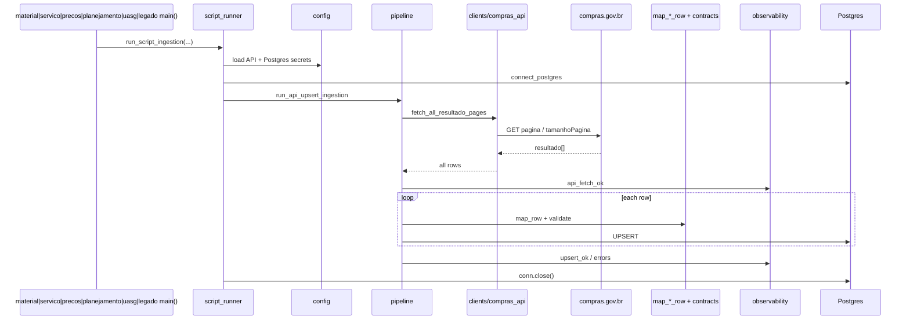

# Architecture — Open Gov Supply Chain Data

Snapshot as of 2026-09-23: shared API→upsert pipeline plus CATMAT (material),
CATSER (serviço), pesquisa de preço (preços praticados), PGC (planejamento),
UASG, LEGADO (Lei 8.666), and the remaining list dumps
(contratações, ARP, contratos, fornecedor, OCDS, indicadores, Alice avisos).
Airflow 3 DAGs in `dags/`. Dev is WSL; prod is the homelab clone after CI.
See [guia-deploy.md](./guia-deploy.md).

## System layers



## CATMAT load order



## CATSER load order



**CATSER run order:** secao → divisao → grupo → classe → subclasse → item → (unidade_medida | natureza_despesa).

## Pesquisa de preço load order

Price endpoints require a CATMAT/CATSER item code. Scripts read codes from
the catalog tables, then paginate each code.



JSON endpoints only (`1_consultarMaterial`, `2_consultarMaterialDetalhe`,
`3_consultarServico`, `4_consultarServicoDetalhe`). CSV variants are skipped.

Each code call sends `dataCompraInicio` from dest `MAX(data_compra)` (detalhe
uses `MAX(data_atualizacao_fato)`). After a full catalog pass the code cursor
resets to 0 so the next run revisits codes; dest dates prevent re-downloading
history.

## Incremental load

`.env` date windows are the **backfill ceiling**. Destination `MAX(date)`
**raises the floor** (overlapping the last loaded day). `etl_code_cursor` is
crash resume inside that raised slice only.

Keyed children skip dest keys already loaded: `pgc_detalhe_catalogo` skips
class/group codes present for that `ano_artefato`; ARP empenho/unidade/adesão
walk missing ATA keys from dest `arp` / `arp_item` (`.env` ATA is fallback when
the parent table is empty).

CATMAT, CATSER, UASG, fornecedor, indicadores, `pgc_detalhe`, `pgc_agregacao`,
and legado modalidade/year dumps stay page-resume: those APIs cannot filter
“not already in dest”.

## PGC load order

Detalhe and agregação require `PGC_ORGAO` + `PGC_ANO` in `.env`. Catalogo
walks CATMAT classes and CATSER groups for one PCA year.



JSON endpoints only (`1_consultarPgcDetalhe`, `2_consultarPgcDetalheCatalogo`,
`3_consultarPgcAgregacao`). CSV variants are skipped.

See [pgc-ingestion.md](./pgc-ingestion.md).

## UASG load order

Both JSON endpoints require a status boolean. Scripts walk `true` then `false`.
CSV variants are skipped.



See [uasg-ingestion.md](./uasg-ingestion.md).

## LEGADO load order

Lei 8.666 list endpoints require a date window, year, or modalidade from `.env`.
Lookup-by-id variants are skipped. Headers and items can be loaded independently.



See [legado-ingestion.md](./legado-ingestion.md).

## Remaining list dumps

Lei 14.133 contratações, ARP, contratos, fornecedor, OCDS, indicadores, and
Alice avisos. Lookup-by-id, Alice chave/ticket, usuarios, and autenticacao
are skipped.

ARP (and ARP item / fim de vigência) date windows are split into slices of at
most 365 days (`run_sliced_remaining_ingestion` / `iso_date_slices`). When
`numeroControlePncpAta` is null the mapper derives
`{codigo_unidade_gerenciadora}:{numero_ata_registro_preco}`.

See [remaining-ingestion.md](./remaining-ingestion.md).

## Environments and Airflow

Manual Airflow 3 DAGs (`dags/open_gov_*.py`) call `register_ingest_dag` and
`run_named_ingest`. Prod Airflow bind-mounts the homelab clone so a `git pull`
is enough. DAGs stay paused until someone triggers them.

CI: [`.github/workflows/ci.yml`](../.github/workflows/ci.yml) runs pytest on
GitHub, then a self-hosted runner fast-forwards prod. Deploy steps:
[guia-deploy.md](./guia-deploy.md). Analytics models live under `dbt-open-gov/`.

## Shared ingestion pipeline

See [ingestion-api-upsert-refactor.md](./ingestion-api-upsert-refactor.md).
CATSER details: [servico-catser-ingestion.md](./servico-catser-ingestion.md).
PGC details: [pgc-ingestion.md](./pgc-ingestion.md).
UASG details: [uasg-ingestion.md](./uasg-ingestion.md).
LEGADO details: [legado-ingestion.md](./legado-ingestion.md).
Remaining modules: [remaining-ingestion.md](./remaining-ingestion.md).



## Module map

| Layer | Path | Role |
| --- | --- | --- |
| Config | `src/config/load_secret_key.py` | Load secrets from `.env` |
| Client | `src/clients/compras_api.py` | Paginated API fetch |
| Contracts | `src/contracts/*` | Pydantic validation |
| Dest watermark | `src/etl/ingestion/dest_watermark.py` | Raise API start dates from dest MAX(date) |
| Text helpers | `src/contracts/text_normalize.py` | Shared upper/strip helpers |
| Coercion | `src/contracts/coerce.py` | id/number coercion for price, PGC, and LEGADO rows |
| DB wrapper | `src/etl/ingestion/db.py` | Injectable Postgres connect |
| Pipeline | `src/etl/ingestion/pipeline.py` | Fetch → map → upsert |
| Script runner | `src/etl/ingestion/script_runner.py` | Wire secrets + DB for scripts |
| CATMAT ETL | `src/etl/ingestion/material/*.py` | Material catalog scripts |
| CATSER ETL | `src/etl/ingestion/servico/*.py` | Serviço catalog scripts |
| Preços ETL | `src/etl/ingestion/precos/*.py` | Practiced-price scripts |
| PGC ETL | `src/etl/ingestion/planejamento/*.py` | Planning (PGC) scripts |
| UASG ETL | `src/etl/ingestion/uasg/*.py` | UASG and órgão scripts |
| LEGADO ETL | `src/etl/ingestion/legado/*.py` | Lei 8.666 licitação scripts |
| Remaining ETL | `src/etl/ingestion/{contratacoes,arp,contratos,fornecedor,ocds,indicadores,alice}/` | Lei 14.133, ARP, contratos, and related dumps |
| Date slices | `src/etl/ingestion/iso_date_slices.py` | Split ISO windows (ARP ≤ 365 days) |
| Airflow factory | `dags/open_gov_ingest.py` | One manual DAG per ingest script |
| CI | `.github/workflows/ci.yml` | pytest then prod `git pull` |
| SQL | `src/sql/create_table_*.sql` | Table DDL |
| Observability | `src/observability/logging_json.py` | JSON logs |
| Analytics | `dbt-open-gov/` | Staging + analytics models |

## Run scripts

```bash
PYTHONPATH=src python src/etl/ingestion/material/material_item.py
PYTHONPATH=src python src/etl/ingestion/servico/servico_secao.py
PYTHONPATH=src python src/etl/ingestion/precos/preco_material.py
PYTHONPATH=src python src/etl/ingestion/planejamento/pgc_detalhe.py
PYTHONPATH=src python src/etl/ingestion/uasg/uasg_orgao.py
PYTHONPATH=src python src/etl/ingestion/uasg/uasg.py
PYTHONPATH=src python src/etl/ingestion/legado/legado_licitacao.py
PYTHONPATH=src python src/etl/ingestion/contratacoes/contratacao.py
PYTHONPATH=src python src/etl/ingestion/arp/arp.py
PYTHONPATH=src python src/etl/ingestion/contratos/contrato.py
PYTHONPATH=src python src/etl/ingestion/fornecedor/fornecedor.py
```
