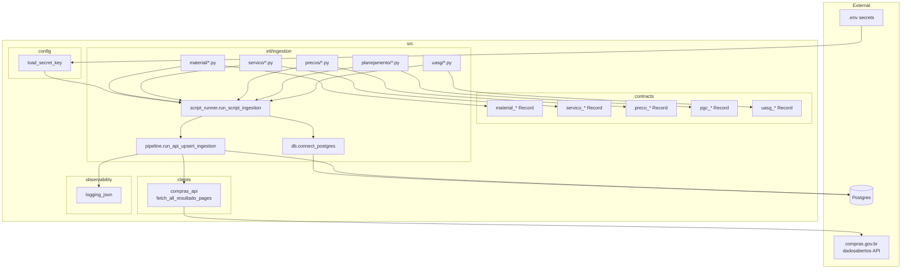
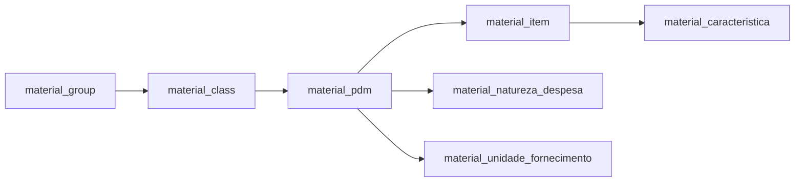
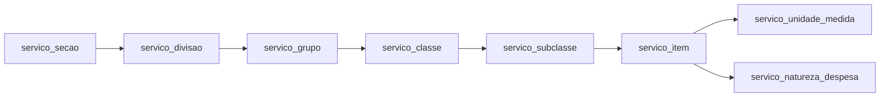
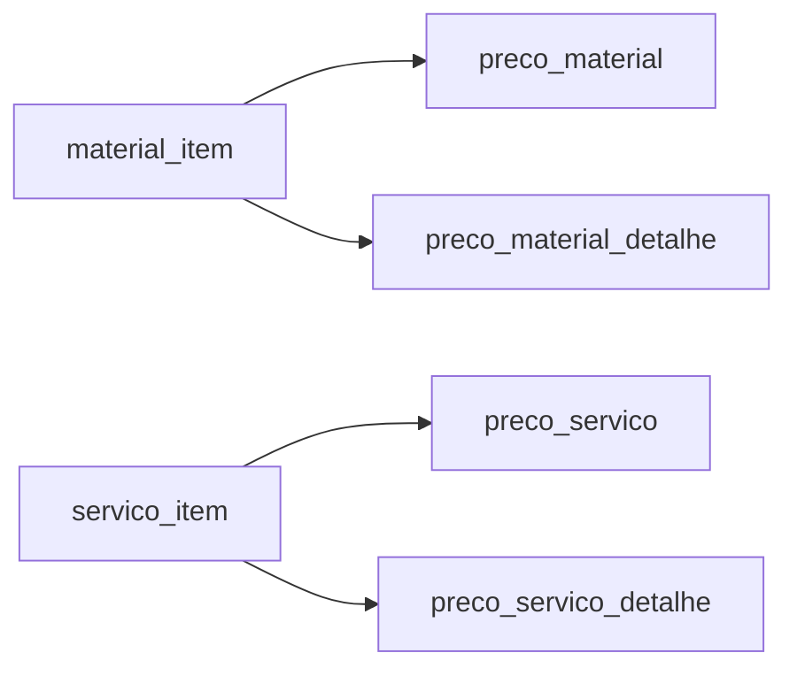
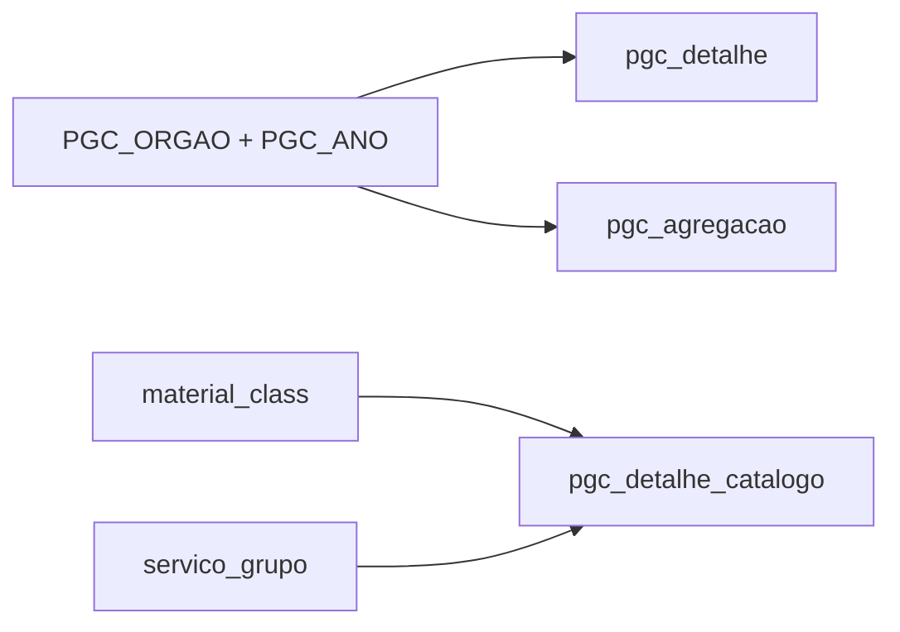
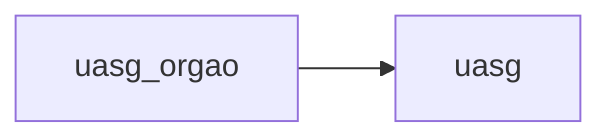
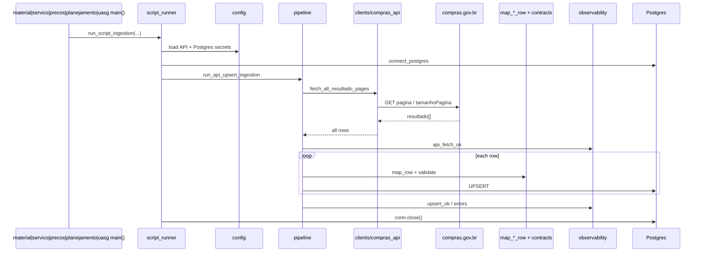

# Architecture — Open Gov Supply Chain Data

Snapshot as of 2026-09-19: shared API→upsert pipeline plus CATMAT (material),
CATSER (serviço), pesquisa de preço (preços praticados), PGC (planejamento),
and UASG catalogs.

## System layers



## CATMAT load order



## CATSER load order



**CATSER run order:** secao → divisao → grupo → classe → subclasse → item → (unidade_medida | natureza_despesa).

## Pesquisa de preço load order

Price endpoints require a CATMAT/CATSER item code. Scripts read codes from
the catalog tables, then paginate each code.



JSON endpoints only (`1_consultarMaterial`, `2_consultarMaterialDetalhe`,
`3_consultarServico`, `4_consultarServicoDetalhe`). CSV variants are skipped.

## PGC load order

Detalhe and agregação require `PGC_ORGAO` + `PGC_ANO` in `.env`. Catalogo
walks CATMAT classes and CATSER groups for one PCA year.



JSON endpoints only (`1_consultarPgcDetalhe`, `2_consultarPgcDetalheCatalogo`,
`3_consultarPgcAgregacao`). CSV variants are skipped.

See [pgc-ingestion.md](./pgc-ingestion.md).

## UASG load order

Both JSON endpoints require a status boolean. Scripts walk `true` then `false`.
CSV variants are skipped.



See [uasg-ingestion.md](./uasg-ingestion.md).


## Shared ingestion pipeline

See [ingestion-api-upsert-refactor.md](./ingestion-api-upsert-refactor.md).
CATSER details: [servico-catser-ingestion.md](./servico-catser-ingestion.md).
PGC details: [pgc-ingestion.md](./pgc-ingestion.md).
UASG details: [uasg-ingestion.md](./uasg-ingestion.md).



## Module map

| Layer | Path | Role |
| --- | --- | --- |
| Config | `src/config/load_secret_key.py` | Load secrets from `.env` |
| Client | `src/clients/compras_api.py` | Paginated API fetch |
| Contracts | `src/contracts/material_*.py`, `servico_*.py`, `preco_*.py`, `pgc_*.py`, `uasg*.py` | Pydantic validation |
| Text helpers | `src/contracts/text_normalize.py` | Shared upper/strip helpers |
| Coercion | `src/contracts/coerce.py` | id/number coercion for price and PGC rows |
| DB wrapper | `src/etl/ingestion/db.py` | Injectable Postgres connect |
| Pipeline | `src/etl/ingestion/pipeline.py` | Fetch → map → upsert |
| Script runner | `src/etl/ingestion/script_runner.py` | Wire secrets + DB for scripts |
| CATMAT ETL | `src/etl/ingestion/material/*.py` | Material catalog scripts |
| CATSER ETL | `src/etl/ingestion/servico/*.py` | Serviço catalog scripts |
| Preços ETL | `src/etl/ingestion/precos/*.py` | Practiced-price scripts |
| PGC ETL | `src/etl/ingestion/planejamento/*.py` | Planning (PGC) scripts |
| UASG ETL | `src/etl/ingestion/uasg/*.py` | UASG and órgão scripts |
| SQL | `src/sql/create_table_*.sql` | Table DDL |
| Observability | `src/observability/logging_json.py` | JSON logs |

## Run scripts

```bash
PYTHONPATH=src python src/etl/ingestion/material/material_item.py
PYTHONPATH=src python src/etl/ingestion/servico/servico_secao.py
PYTHONPATH=src python src/etl/ingestion/precos/preco_material.py
PYTHONPATH=src python src/etl/ingestion/planejamento/pgc_detalhe.py
PYTHONPATH=src python src/etl/ingestion/uasg/uasg_orgao.py
PYTHONPATH=src python src/etl/ingestion/uasg/uasg.py
```
